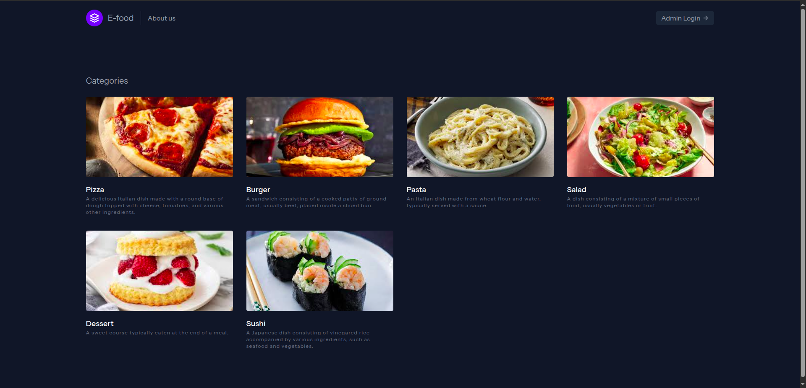
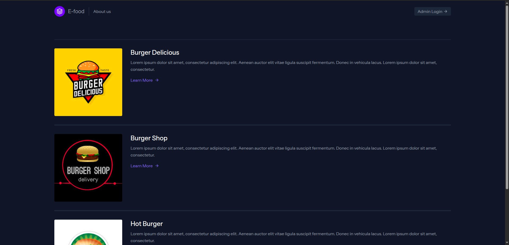
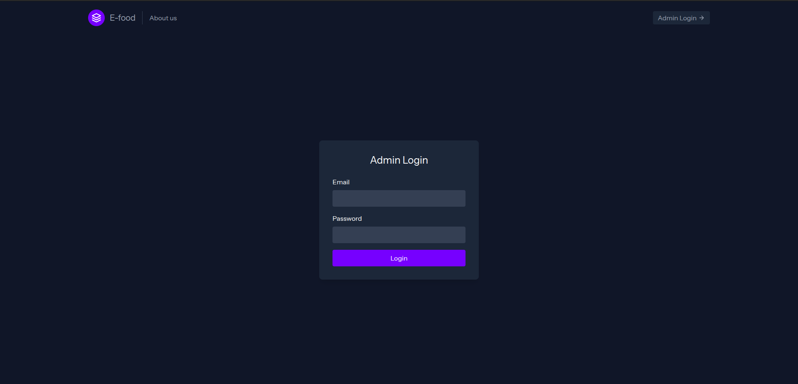
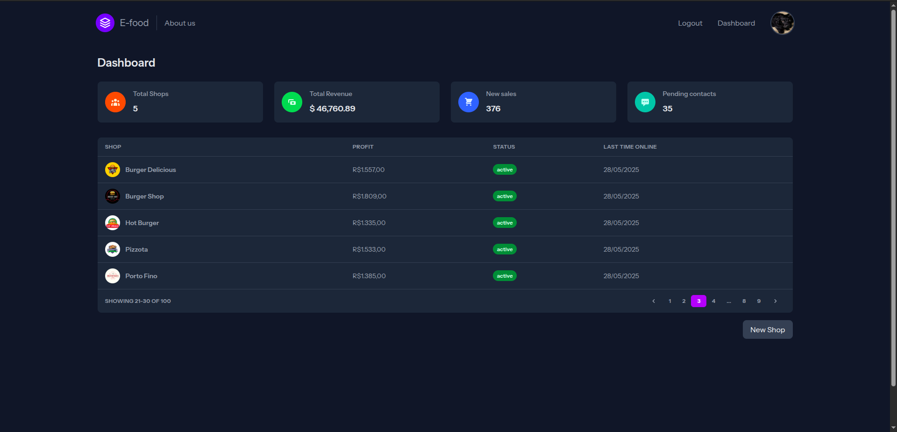
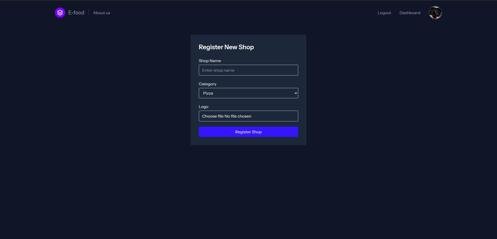

# Bem vindo!

#### Este é um pequeno projeto baseado em Laravel desenvolvido para a matéria de Desenvolvimento de Aplicações Backend com Framework.

## Tabela de conteúdos

### 1 - [Visão Geral](#visão-geral)
### 2 - [Módulos Utilizados](#módulos-utilizados)
### 3 - [Como Executar](#como-executar)
### 4 - [Prints da Aplicação](#prints-da-aplicação)

## Visão Geral

A proposta desta aplicação é mimetizar "vitrines" online de restaurantes (como Ifood, Aiqfome etc). Ela é composta basicamente de 5 telas diferentes, sendo elas:

1 - Tela principal (onde são mostradas as categorias de lojas)

2 - Lista de lojas dentro de uma determinada categoria

3 - Tela de Login (apenas para administradores)

4 - Dashboard de administração, mostrando métricas (como número de lojas) e as lojas cadastradas (ativas e inativas)

5 - Cadastro de nova loja.

## Módulos Utilizados

Os 5 módulos que compõe a matéria e que são mais destacáveis são (não necessariamente em ordem):

1 - Views com Blade

2 - Estilização com TailwindCSS

3 - Forms e Validação de requisições

4 - Autenticação de Usuários

5 - Upload de Arquivos

Outros elementos utilizados incluem:

- Migrações
- Roteamente e Ciclo de Vida

## Como Executar

### Instale as dependências do backend com Composer

`composer install`

### Instale as dependências do frontend com NPM

`npm install`

### Crie o arquivo .env

OBS: Este comando considera que você está no _root_ do projeto.

`cp .env.example .env`

### Gere a chave do projeto

`php artisan key:generate `

### Crie o arquivo do SQLite

OBS: Este comando considera que você está no _root_ do projeto.

`> database/database.sqlite`

### Execute as migrações e os Seeders

`php artisan migrate:fresh`

`php artisan db:seed`

### Crie o link para a pasta de _storage_

`php artisan storage:link`

### Rode o projeto localmente

`composer run dev`

E acesse o link que será mostrado no terminal.

Você pode acessar o dashboard com a seguinte conta:

admin@email.com

admin123

## Prints da Aplicação

### Tela Inicial

### Lista de lojas

### Login

### Dashboard

### Form de criação de nova loja

